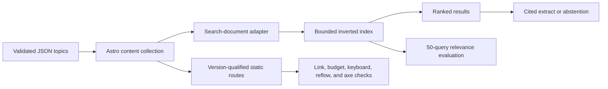

# Relay Knowledge Portal

[](https://github.com/JasonStys/versioned-product-knowledge-portal/actions/workflows/ci.yml)

A static-first, version-aware product documentation portal built with Astro and strict TypeScript.
It demonstrates how a knowledge experience can keep product applicability, lifecycle status, source
evidence, accessible presentation, and measured search quality attached to every answer.

All products, identifiers, procedures, and source records are synthetic. This repository is an
independent portfolio project and is not operating guidance for real equipment.

## 60-second quick start

Prerequisites: Node.js 22.12–24 and pnpm 11.

```bash
pnpm install --frozen-lockfile
pnpm dev
```

Open `http://localhost:4321`, select **Search**, choose version `2.0`, and search for `E-104`.
Change the filter to `1.5` to see why version context is part of the retrieval contract.

Run the complete non-browser quality gate:

```bash
pnpm validate
```

Install Chromium once and run the browser/accessibility suite:

```bash
pnpm exec playwright install chromium
pnpm test:e2e
```

## What this proves

- **Version correctness:** every canonical URL includes product, version, and topic slug; reused
  diagnostic codes are disambiguated by explicit filters.
- **Measured lexical retrieval:** a bounded inverted index uses BM25-style scoring, field weights,
  exact-identifier boosts, reviewed synonyms, deterministic tie-breaking, and a 50-query judgment
  set.
- **Grounded behavior:** the experimental answer panel repeats only a retrieved source summary,
  cites versioned pages, and abstains below a relevance threshold.
- **Accessible delivery:** semantic landmarks, skip navigation, visible focus, non-color-only
  status, 320-pixel reflow, keyboard tests, and Playwright/axe checks cover the automated portion of
  the accessibility plan.
- **Reviewable provenance:** every topic exposes its synthetic source ID, page references, and
  SHA-256 checksum.
- **Safe static operation:** public pages need no application server, database, credentials, or
  client-side access-control assumptions.

## Architecture at a glance



The public site is generated at build time. The only browser JavaScript initializes the search
panel, applies filters, ranks local documents, and creates results with `textContent`. See
[architecture](docs/architecture.md) and [ADR 0001](docs/adr/0001-static-first-portal.md).

## Major features

### Product and version model

`src/data/products.ts` defines two invented product families and their current, maintained, and
retired versions. `src/content.config.ts` blocks the build when a topic violates identifiers, dates,
lifecycle, provenance, section, or complete-warning requirements.

### Search and answers

`src/lib/search.ts` builds an in-memory inverted index in O(T) time, where T is the number of
indexed tokens. Query work is O(P + R log R), where P is the total postings visited and R is the
number of matching documents. The corpus is intentionally small; the ADR describes when to replace
the local index with a dedicated service.

Exact identifiers such as `E-104` and `REG-40001` receive a separate boost. Query expansion is
limited to a reviewed synonym map, and product/version filtering happens before scoring. The answer
mode never invokes a model or tool—it returns a source summary and citations or an explicit
abstention.

### Validation evidence

`pnpm validate` checks formatting, lint, strict types, branch coverage, production build, internal
links, static-asset budgets, and search relevance. GitHub Actions repeats the gate on Node 22 and
24; a separate Chromium job tests keyboard behavior, mobile reflow, version filtering, and
detectable WCAG A/AA violations. Reports are retained as workflow artifacts.

## Repository map

| Path                    | Purpose                                                                           |
| ----------------------- | --------------------------------------------------------------------------------- |
| `src/content/topics/`   | Schema-validated synthetic product knowledge.                                     |
| `src/lib/`              | Content adapters, contracts, redirects, search engine, and browser binding.       |
| `src/pages/`            | Static landing, catalog, search, version, topic, about, and 404 routes.           |
| `src/components/`       | Accessible lifecycle, warning, topic, version, and search components.             |
| `src/styles/global.css` | Responsive tokens and component styles, including print/reduced motion.           |
| `tests/unit/`           | Search, data integrity, redirect, repository-policy, and adapter tests.           |
| `tests/e2e/`            | Keyboard, reflow, search, topic, and axe browser tests.                           |
| `tools/`                | Search evaluation, link/budget validation, topic loading, and symbol indexes.     |
| `docs/`                 | Architecture, contracts, ADRs, security, accessibility, operations, and evidence. |
| `.github/`              | Least-privilege CI and grouped dependency updates.                                |

The [file reference](docs/file-reference.md) explains every authored or generated file.

## Commands

| Command                | Result                                                  |
| ---------------------- | ------------------------------------------------------- |
| `pnpm dev`             | Local Astro development server.                         |
| `pnpm build`           | Reproducible static build in `dist/`.                   |
| `pnpm test:coverage`   | Unit and policy tests with enforced branch coverage.    |
| `pnpm test:e2e`        | Chromium desktop/mobile and accessibility checks.       |
| `pnpm evaluate:search` | JSON and Markdown relevance evidence from 50 judgments. |
| `pnpm validate:links`  | Internal-link crawl and JavaScript/CSS budget report.   |
| `pnpm update:headers`  | Regenerate line-accurate file symbol indexes.           |
| `pnpm validate`        | Complete non-browser validation gate.                   |

## Documentation

- [Architecture and complexity](docs/architecture.md)
- [Content and URL contracts](docs/content-model.md)
- [Search evaluation](docs/search-evaluation.md)
- [Testing and validation](docs/testing-and-validation.md)
- [Accessibility](docs/accessibility.md)
- [Security model](docs/security-model.md)
- [Operations and rollback](docs/operations.md)
- [File reference](docs/file-reference.md)
- [Research references](docs/references.md)
- [Contributing](CONTRIBUTING.md) and [security reporting](SECURITY.md)

## Limitations

- The corpus and judgment set are synthetic and small; reported relevance does not generalize to a
  commercial documentation estate.
- Automated accessibility checks find only a subset of barriers and do not establish conformance.
- The answer preview is extractive—not semantic or generative—and has no authorization layer because
  the repository contains only public sample content.
- The redirect manifest must be applied by a hosting adapter; static object storage alone cannot
  emit HTTP redirect status codes.
- No procedure in this demonstration should be used to control or service real equipment.

## License

Code and synthetic content are available under the [MIT License](LICENSE).
