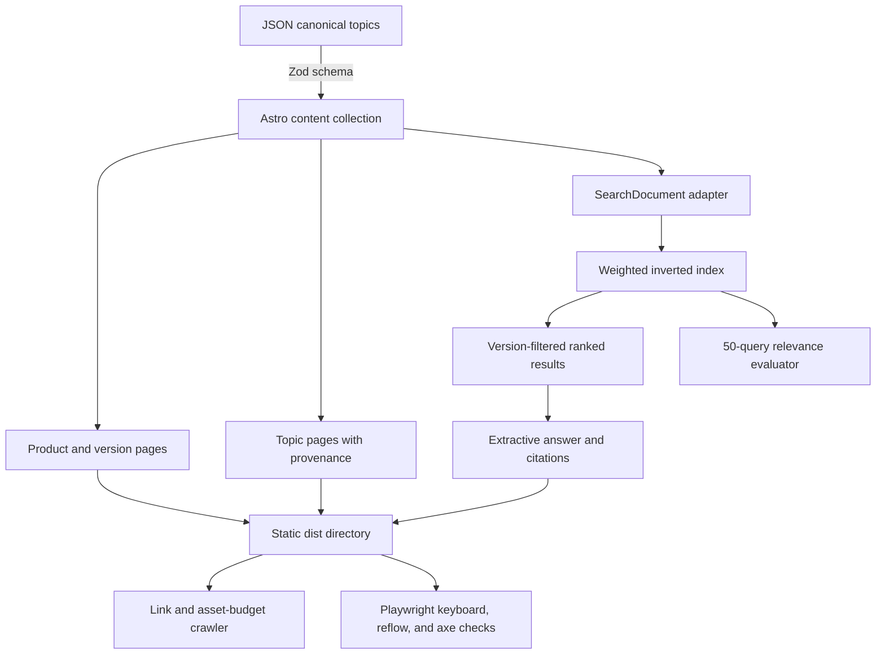

# Architecture and complexity

## Context and goals

The portal must publish product knowledge that remains correct as products and software versions
change. It optimizes for static public delivery, inspectable retrieval, accessibility, stable URLs,
and evidence that can be reviewed in a pull request. It does not implement private content, device
commands, or a generative answer service.

## Data flow

## Components and boundaries

| Component          | Responsibility                                                      | Boundary                                                  |
| ------------------ | ------------------------------------------------------------------- | --------------------------------------------------------- |
| Content collection | Validate topic IDs, metadata, versions, warnings, and provenance.   | Build fails before a route is emitted.                    |
| Route generator    | Emit stable `/docs/{product}/{version}/{slug}/` pages.              | Product/version are never inferred from browser state.    |
| Search adapter     | Remove provenance internals and flatten sections to plain text.     | No active HTML enters the index.                          |
| Search engine      | Build postings, apply reviewed expansion, filter, score, and limit. | Query length, tokens, results, and synonyms are bounded.  |
| Search client      | Bind forms and create result/citation nodes.                        | Uses `textContent`; no corpus string becomes markup.      |
| Answer preview     | Return one retrieved summary and cited sources or abstain.          | No model, network, action tool, or generated instruction. |
| Validation tools   | Evaluate search, links, budgets, headers, tests, and build.         | Machine-readable evidence is retained in CI.              |

## Search algorithm

Each field contributes weighted term frequency: identifiers 8, title 5, reviewed topic synonyms 4,
headings 3, summary 2, product name 1.5, and body 1. At build/runtime initialization,
`createSearchIndex` tokenizes every field and constructs an inverted map. The query path normalizes
at most 160 characters and 12 base tokens, adds only first-level reviewed synonyms, visits matching
postings, applies a BM25-style length normalization, and adds separate exact identifier and
title-phrase boosts. Product and version filters are checked before scoring.

Let:

- **T** be total indexed tokens,
- **Q** be bounded query terms after expansion,
- **P** be postings visited for those terms,
- **R** be matched documents, and
- **D** be document count.

Index construction is O(T) time and O(T + D) space. Query work is O(Q + P + R log R) time and O(R)
temporary space. With the current small corpus, a browser-local index keeps deployment simple.
Revisit the design when compressed index size, initialization, authorization, language morphology,
or corpus update frequency exceeds the published budgets.

## Failure modes

- Invalid content stops the Astro build with a schema path.
- Missing routes or assets fail the generated-site crawler.
- Search regressions fail Recall@5 or mean reciprocal-rank gates.
- A low-scoring question returns an explicit abstention.
- A maintained or retired route displays an in-content status banner.
- Unknown legacy paths are not guessed; only reviewed local redirect entries resolve.

## Deployment and rollback

The output is immutable static content. Publish a content-addressed build, validate it, then switch
the host's release pointer. Rollback switches that pointer to the prior artifact and reapplies its
matching redirect manifest. See [operations](operations.md).

## Related decisions

- [ADR 0001: Static-first Astro portal](adr/0001-static-first-portal.md)
- [ADR 0002: Deterministic lexical search before semantic retrieval](adr/0002-deterministic-lexical-search.md)
- [ADR 0003: Separate public and restricted search](adr/0003-public-restricted-boundary.md)
